# NavBot

## 1. Product Pitch

**NavBot** is an AI chatbot-as-a-service. Any website owner can add a smart Q&A chatbot to their site in under 5 minutes — no ML knowledge, no backend changes.

### The Problem

- Visitors can't find information quickly (nested pages, PDFs, scattered FAQs).

### What NavBot Does

NavBot crawls your website, indexes the content into a vector database, and gives you a chatbot that answers **only from your site's content** — with source links.

Here's what the landing page looks like:

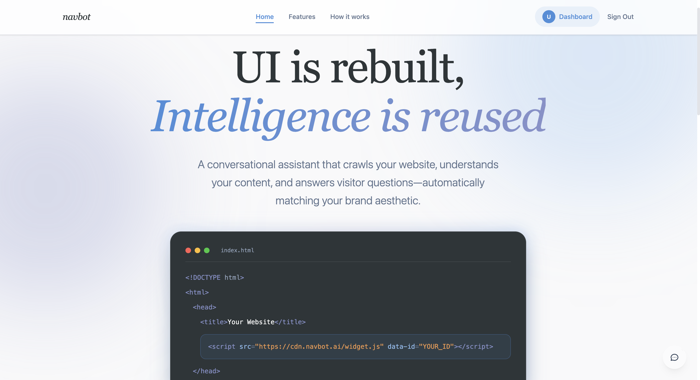

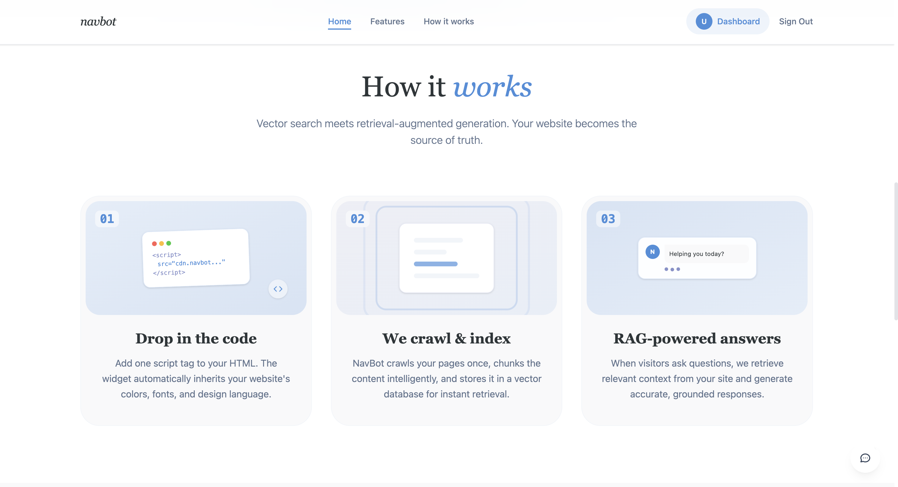


### How You Onboard

1. **Sign up** (email/password or Google/GitHub OAuth).
2. **Paste your website URL** in the dashboard.
3. NavBot **crawls** your pages, extracts text (including tables), and stores embeddings.
4. **Copy one `<script>` tag** into your HTML.
5. A floating chatbot appears on your site — visitors ask questions via text or voice.

### Why NavBot

| Feature | Description |
|---------|-------------|
| Website-only answers | RAG ensures the bot never makes things up |
| One-line integration | Single `<script>` tag — no backend changes |
| Multi-site support | One account, unlimited websites |
| Voice input | Visitors speak questions via browser mic |
| Indian language support | Powered by Sarvam AI |

Here's our features page that explains what NavBot can do:

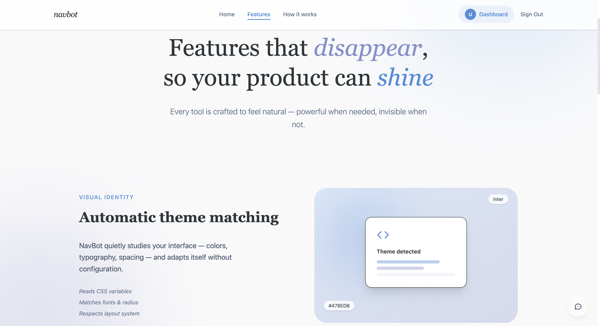

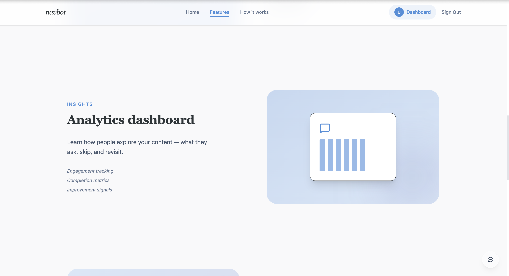

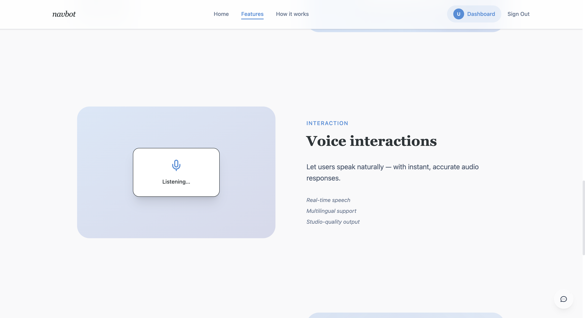

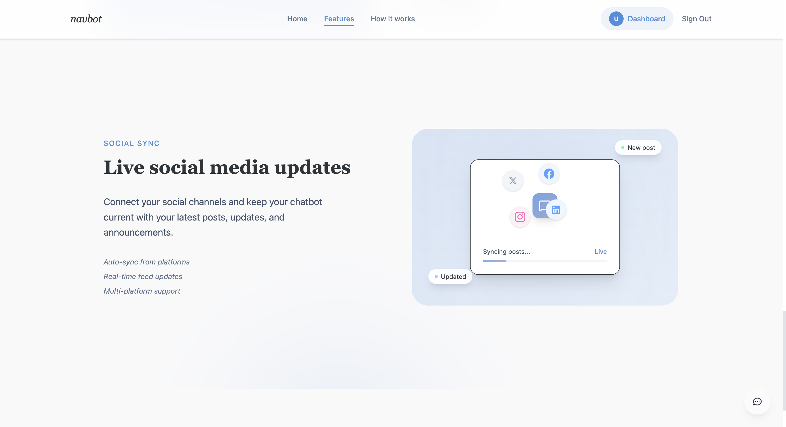

### Future Scope

- Admin dashboard for platform-wide usage monitoring
- Billing and subscription tiers
- Custom bot appearance editor
- Analytics export and email reports

---

## 2. User Journeys

### User 1: Website Owner (Primary)

**Who:** Business owner, developer, or marketing team member.

**Why they log in:** Set up, manage, and monitor chatbot(s) on their website(s).

**Before NavBot:** Answered visitor queries manually via email/contact forms, hired support staff, or used rigid rule-based chatbots that needed manual FAQ authoring.
**Why they log in**: To set up, manage, and monitor their chatbot(s).

**How they were doing this earlier**: Manually answering visitor queries via email, contact forms, or hiring support staff. No insights on FAQs.

**Journey:**

```
Homepage → "Get Started"
  → Sign Up / Sign In
  → Dashboard
  → "Add Website" → paste URL
  → Scraping runs (fetching → analyzing → indexing → ready)
  → Site appears in Websites list (e.g. "17 pages indexed")
  → Click site → Integration panel
  → Copy <script> snippet → paste into website HTML
  → Chatbot is live
```

**Step 1 — Sign Up / Sign In:**

Users create an account or sign in with email, Google, or GitHub.

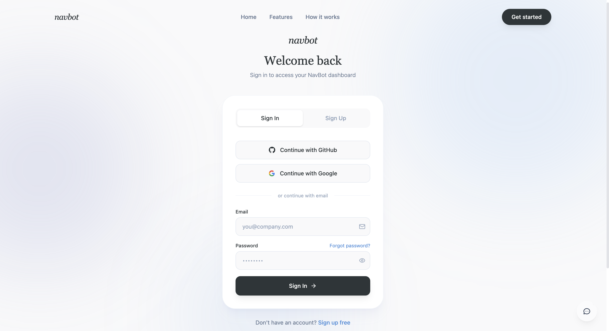

**Step 2 — Dashboard Overview:**

After logging in, users land on the dashboard where they can see their stats and manage sites.

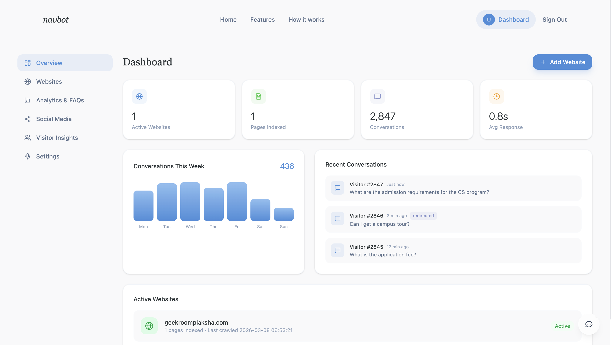

**Step 3 — Add a Website & Scraping:**

Users paste a URL. NavBot crawls and indexes all pages automatically with a live progress animation.

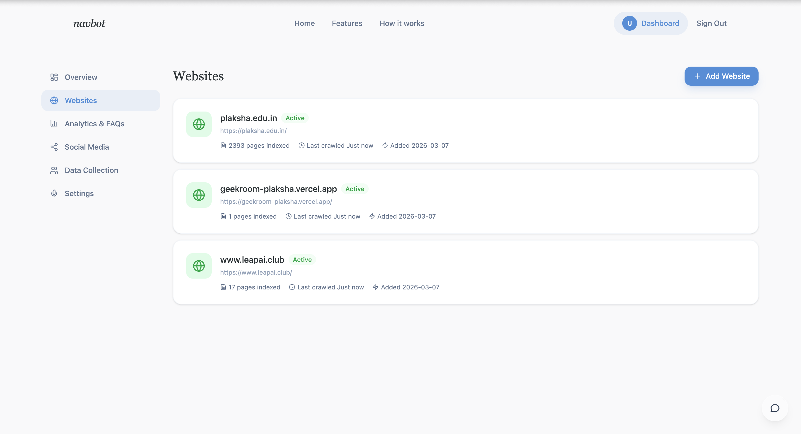

**Step 4 — Get the Integration Code:**

Click on a site to see the integration panel — copy two lines of HTML and paste into your website.

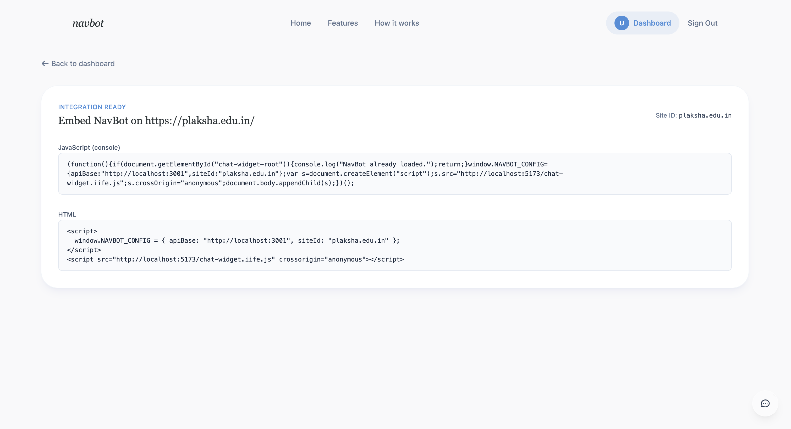

**After setup — Dashboard Tabs:**

```
Dashboard
  ├── Overview     → total queries, pages indexed, active sites
  ├── Websites     → manage sites, reindex, delete
  ├── Analytics    → query volume chart, top questions, FAQs
  ├── Visitor Insights → recent conversations, interactions
  ├── Social Media → connect social channels (future)
  └── Settings     → toggle voice, configure bot behavior
```

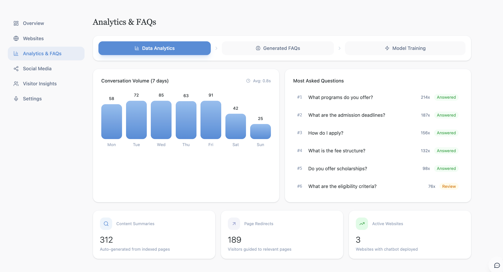

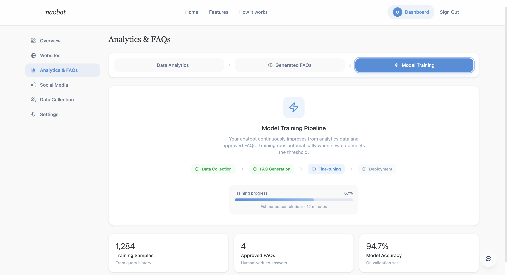

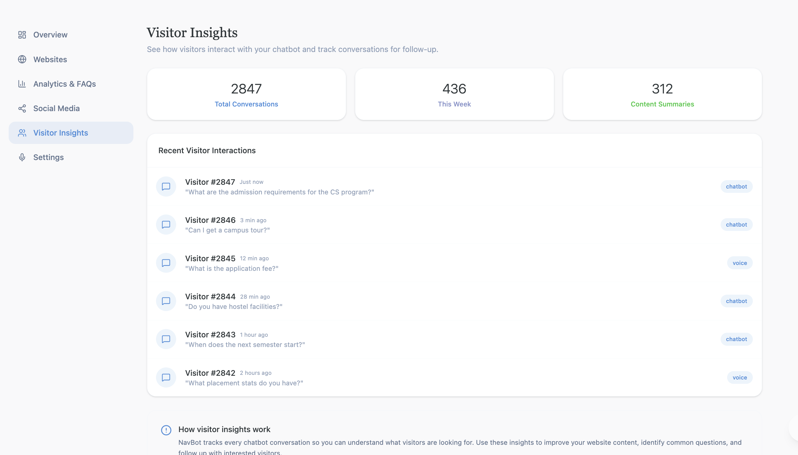

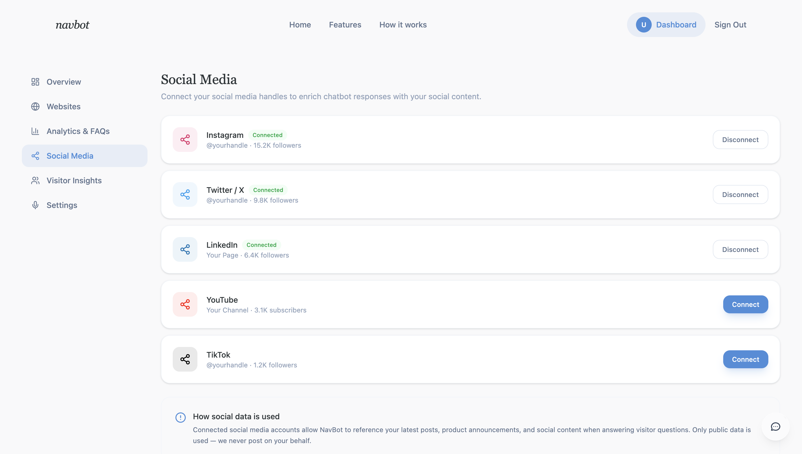

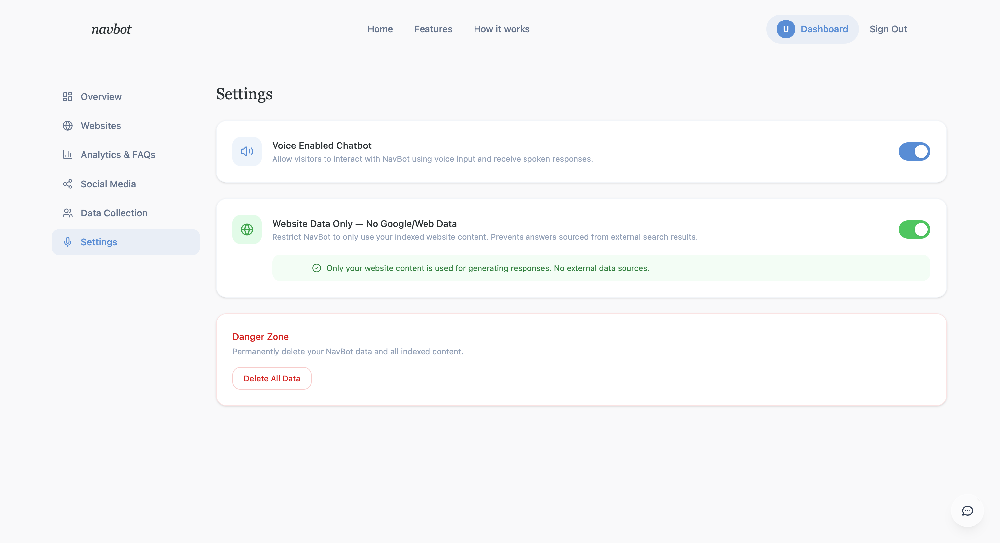

### User 2: Website Visitor (End User)

**Who:** Someone browsing a site that has NavBot installed (e.g., a prospective student on a university site).

**Why they interact:** Find specific info fast, without digging through pages.

**Before NavBot:** Browse multiple pages, Ctrl+F, read FAQ pages, email the organization and wait for a reply.
**How they were doing this earlier**: Manually browsing through pages, reading long FAQ pages, or emailing the organization.

**Journey:**

```
Visit website → see floating chat icon (bottom-right)
  → Click → chat panel opens
  → Type: "What is the admission deadline?"
  → NavBot retrieves matching content from indexed pages
  → Sarvam AI generates an answer with source link
  → "Round 1 deadline is Jan 15, 2026 (Source: Admissions page)"
  → Follow-up questions work (conversation history maintained)
  → Voice input available via mic button
```

Here's the chatbot widget in action on a real website:

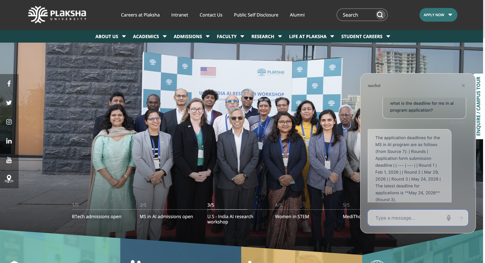

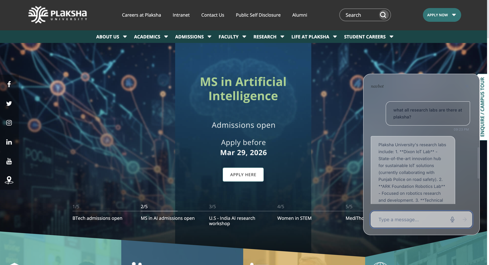

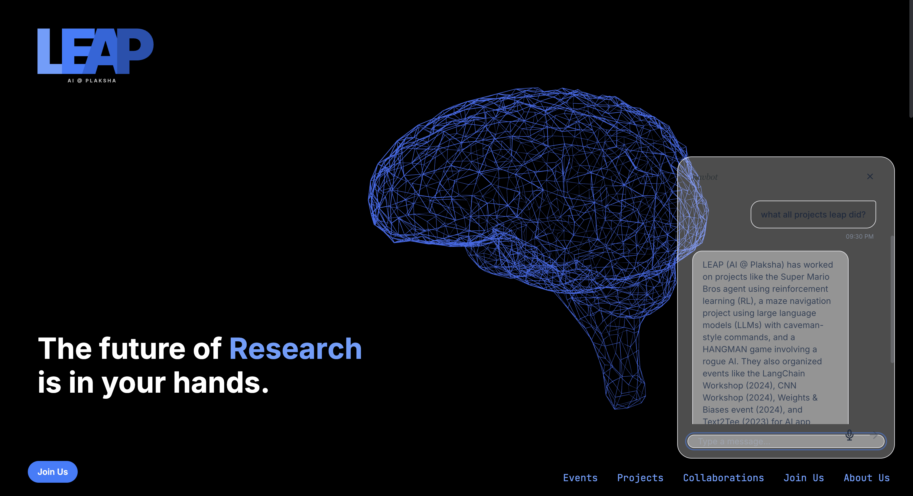

### User 3: Admin (Future Scope)

**Who**: NavBot platform admin managing all tenants.

**Why**: Monitor usage, manage accounts, view aggregated analytics.

---

## 3. Databases in Use

NavBot uses **three databases**, each for a different purpose:

### Database 1: SQLite (Authentication)

**Location**: `apps/server/sqlite.db`
**Purpose**: Stores all user authentication data
**Managed by**: `better-auth` library

We use **SQLite** — a lightweight file-based database that needs zero setup (no separate DB server). It's managed by **better-auth**, a Node.js auth library that handles user registration, login sessions, and OAuth tokens out of the box.

| Table | Columns | Purpose |
|-------|---------|---------|
| `user` | `id`, `name`, `email`, `emailVerified`, `image`, `createdAt`, `updatedAt` | Registered users |
| `session` | `id`, `expiresAt`, `token`, `ipAddress`, `userAgent`, `userId`, `createdAt`, `updatedAt` | Active login sessions |
| `account` | `id`, `accountId`, `providerId`, `userId`, `accessToken`, `refreshToken`, `password` | OAuth + email/password credentials |
| `verification` | `id`, `identifier`, `value`, `expiresAt` | Email verification tokens |

**Why SQLite**: Lightweight, zero-config, perfect for auth in a dev/small-scale deployment. No separate DB server needed.

### Database 2: SQLite (Site Metadata)

**Location**: `apps/api/navbot-api.db`
**Purpose**: Persists which websites each user has indexed, so data survives server restarts

| Table | Key Columns | Purpose |
|-------|-------------|---------|
| `site` | `site_id`, `user_id`, `url`, `hostname`, `pages_indexed`, `status`, `added_at`, `last_crawled` | Tracks indexed websites per user |

Unique constraint on `(site_id, user_id)` — each user's site entries are independent.

### Database 3: ChromaDB (Vector Store)

**Location**: Chroma Cloud
**Purpose**: Stores website content as vector embeddings for semantic search (RAG retrieval)

We use **ChromaDB**, an open-source vector database built for AI applications. It stores website content as **embeddings** (numerical representations of text that capture meaning). This lets us do **semantic search** — finding content that's _related_ to a question, even if the exact words don't match.

| Concept | Details |
|---------|---------|
| **Collection** | One per site: `site_{siteId}` (e.g., `site_www.leapai.club`) |
| **Document** | A text chunk (~900 chars) from a crawled page |
| **Metadata** | `siteId`, `url`, `title`, `chunkIndex`, `totalChunks` |
| **Embedding** | Generated by ChromaDB default embedder |
| **ID** | `{pageUrl}#chunk_{index}` for uniqueness |

**How data flows in**:

```
Website URL → Crawler (Cheerio) → Raw HTML → Structured text extraction
    → Chunking (900 chars, 150 overlap) → ChromaDB upsert with embeddings
```

**How data flows out (retrieval)**:

```
User question → Query expansion → Semantic search (top-8 chunks)
    → Deduplication → Context string → Sarvam AI LLM → Answer
```

---

## 4. API Endpoints

**Base URL**: `http://localhost:3001`

**Swagger UI** (all routes + example “test case” payloads): `http://localhost:3001/api-docs`

### Site Indexing

| Method | Endpoint | Request Body | Response | Purpose |
|--------|----------|-------------|----------|---------|
| `GET` | `/api/sites?userId=...` | — | `[{ id, url, hostname, status, pagesIndexed, ... }]` | List user's saved sites |
| `POST` | `/api/sites` | `{ url: string, siteId?: string }` | `{ siteId, pageCount, stored, failed }` | Crawl a website, chunk content, store in ChromaDB |
| `POST` | `/api/sites/:siteId/reindex` | `{ url: string }` | `{ siteId, pageCount, stored, failed, reindexed: true }` | Re-crawl and re-index an existing site |
| `DELETE` | `/api/sites/:siteId?userId=...` | — | `{ ok: true }` | Delete a saved site |

### Chat (RAG)

| Method | Endpoint | Request Body | Response | Purpose |
|--------|----------|-------------|----------|---------|
| `POST` | `/api/chat` | `{ siteId, message, history? }` | `{ answer, sources: [{url, title, distance}] }` | Text-based RAG Q&A |
| `POST` | `/api/chat/voice` | FormData: `audio` (file), `siteId` | `{ transcript, answer, sources }` | Voice-based Q&A (STT + RAG) |

### Auth (via Auth Server on port 3000)

| Method | Endpoint | Purpose |
|--------|----------|---------|
| `POST` | `/api/auth/sign-up/email` | Register with email + password |
| `POST` | `/api/auth/sign-in/email` | Login with email + password |
| `POST` | `/api/auth/sign-in/social` | OAuth (Google/GitHub) initiation |
| `GET` | `/api/auth/callback/:provider` | OAuth callback handler |
| `GET` | `/api/auth/get-session` | Check current session |
| `POST` | `/api/auth/sign-out` | Logout |

### Request/Response Flow Example

```json
// POST /api/chat
// Request:
{
  "siteId": "www.leapai.club",
  "message": "What programs do you offer?",
  "history": [
    { "role": "user", "content": "Hi" },
    { "role": "assistant", "content": "Hello! How can I help?" }
  ]
}

// Response:
{
  "answer": "LeapAI offers an AI Fellowship program focused on...",
  "sources": [
    { "url": "https://www.leapai.club/programs", "title": "Programs" },
    { "url": "https://www.leapai.club/about", "title": "About" }
  ]
}
```

---

## 5. Architecture & Code Map

### System Architecture

```
┌──────────────┐    ┌──────────────┐    ┌───────────────┐
│  Web App     │    │  Auth Server │    │  API Server   │
│  (React)     │    │  (Express)   │    │  (Express)    │
│  :5173       │    │  :3000       │    │  :3001        │
└──────┬───────┘    └──────┬───────┘    └──────┬────────┘
       │                   │                   │
       │  auth requests    │                   │
       │──────────────────→│                   │
       │                   │  SQLite (users)   │
       │                                       │
       │  site/chat requests                   │
       │──────────────────────────────────────→│
       │                               ┌───────┴───────┐
       │                               │               │
       │                          ChromaDB       Sarvam AI
       │                          (vectors)      (LLM)
       │                               │
       │                          SQLite (sites)
┌──────┴───────┐
│ Chat Widget  │   ← embedded on customer sites via <script> tag
│ (React IIFE) │   → talks to API at :3001
└──────────────┘
```

### Monorepo Structure

We use **Turborepo** to manage the monorepo — it runs builds/dev scripts across all apps in parallel and caches results. **pnpm workspaces** handles shared dependencies so packages aren't duplicated.

```
NavBot/
├── apps/
│   ├── web/            → React dashboard + marketing pages (Vite, Tailwind)
│   ├── api/            → Express API server (crawling, RAG, ChromaDB, Sarvam AI)
│   └── server/         → Auth server (Express, better-auth, SQLite)
├── packages/
│   ├── chat-widget/    → Embeddable chatbot widget (builds to IIFE bundle)
│   ├── typescript-config/
│   └── eslint-config/
├── turbo.json          → Turborepo task config
└── pnpm-workspace.yaml → pnpm workspaces
```

### Key Technologies We Used (and Why)

| Technology | What it is | Why we chose it |
|-----------|-----------|----------------|
| **Cheerio** | A fast HTML parser for Node.js (like jQuery for the server). We use it to extract text, headings, and tables from crawled web pages. | Lightweight, no browser needed — just parses raw HTML and lets us pick out content with CSS selectors. |
| **ChromaDB** | An open-source vector database designed for AI/ML. Stores text as embeddings and lets you search by meaning (semantic search). | Purpose-built for RAG. One `query()` call returns the most relevant content chunks for any question. |
| **Sarvam AI** | An Indian AI company providing LLMs with native Indian language support. We use their `sarvam-m` model for answer generation. | Supports Indian languages out of the box, which is important for our Plaksha use case. Affordable API. |
| **better-auth** | A TypeScript auth library that handles sign-up, login, sessions, and OAuth with minimal config. | Saves us from building auth from scratch. Works with SQLite, handles token management, session cookies, and OAuth flows. |

### Key Files

| File | What it does |
|------|-------------|
| `apps/api/src/services/crawler.ts` | Crawls websites using `node-fetch` (to download pages) + `cheerio` (to parse HTML and extract text). Converts HTML tables to Markdown format so the chatbot can understand tabular data. Deduplicates pages by hashing content. |
| `apps/api/src/services/vectorstore.ts` | Splits page text into overlapping chunks (~900 chars each with 180-char overlap so no info is lost at boundaries). Upserts chunks into ChromaDB with metadata (URL, title). Also handles semantic queries at retrieval time. |
| `apps/api/src/services/rag.ts` | The brain of the chatbot. Takes a user question, expands it with domain-specific terms (e.g., "deadline" → also search "admission rounds schedule"), retrieves relevant chunks from ChromaDB, builds a context string, sends it to Sarvam AI, and returns the answer with source links. |
| `apps/api/src/services/db.ts` | SQLite persistence layer using `better-sqlite3`. Stores which sites each user has indexed so the data survives server restarts. |
| `apps/api/src/routes/sites.ts` | REST endpoints: list sites (`GET`), add site (`POST`), reindex (`POST`), delete (`DELETE`). Each calls the crawler → vectorstore pipeline. |
| `apps/api/src/routes/chat.ts` | Two endpoints: `POST /api/chat` for text questions, `POST /api/chat/voice` for voice (accepts audio via `multer`, transcribes, then runs the same RAG pipeline). |
| `apps/server/src/auth.ts` | Configures `better-auth` — sets up SQLite as the backing store, enables email/password auth, and conditionally enables Google/GitHub OAuth if API keys are present in env vars. |
| `apps/web/src/pages/DashboardPage.tsx` | The main React dashboard with 6 tabs - includes the "Add Website" flow, scraping animation, site management, and integration code display. |
| `packages/chat-widget/src/ChatWidget.tsx` | The embeddable widget that website owners install. Built as an IIFE (Immediately Invoked Function Expression) — a single JS file that creates a floating chat button, reads config from `window.NAVBOT_CONFIG`, and communicates with our API. Supports text and voice input. |

### How RAG Works (Step by Step)

**RAG = Retrieval-Augmented Generation.** Instead of letting the AI make up answers, we first _retrieve_ relevant content from the website, then give it to the AI as context so it only answers based on real data.

1. **User types a question** in the chat widget.
2. Widget sends `POST /api/chat` with `{ siteId, message, history }`.
3. **Query expansion**: if the question mentions "deadline", "fee", etc., additional targeted queries are generated (e.g., `"admission rounds application deadline dates schedule {original question}"`).
4. **Vector search**: expanded queries are sent to ChromaDB's `site_{siteId}` collection. Top-8 chunks retrieved per query, deduplicated by URL.
5. **Context building**: retrieved chunks are formatted as `[Source N] Title: ... URL: ... {content}` (max 1200 chars per source).
6. **LLM call**: A single system message (instructions + context) + conversation history + user message → sent to Sarvam AI (`sarvam-m` model, temperature 0.2, max 600 tokens).
7. **Response**: LLM answer + deduplicated source URLs returned to the widget.

### How Crawling Works

1. Start from the given URL, fetch HTML via `node-fetch`.
2. Parse with `cheerio`, extract text using `extractStructuredContent()` which preserves headings and converts HTML tables to Markdown format.
3. Follow internal links (same hostname), normalize URLs (remove hash fragments, trailing slashes, sort query params).
4. Skip duplicate content via `contentFingerprint()` (hashes first 500 chars of each page).
5. Respect `maxPages` (500) and `maxDepth` (10) limits.
6. Return array of `{ url, title, content }` for each unique page.

### How Chunking Works

```
Page content (e.g. 3000 chars)
    → Split into chunks of ~900 chars with 150-char overlap
    → Chunk 0: chars 0–900
    → Chunk 1: chars 750–1650    (150 overlap with chunk 0)
    → Chunk 2: chars 1500–2400   (150 overlap with chunk 1)
    → Chunk 3: chars 2250–3000   (150 overlap with chunk 2)

Each chunk gets:
    → ID:       "{url}#chunk_0", "{url}#chunk_1", etc.
    → Metadata: { siteId, url, title }
    → Upserted to ChromaDB (embedding auto-generated)
```

**Why overlap?** So that information spanning a chunk boundary isn't lost. A sentence split across two chunks will appear fully in at least one of them.

### How the Chat Widget Integrates

The website owner adds this to their HTML:

```html
<script>
  window.NAVBOT_CONFIG = { apiBase: "http://localhost:3001", siteId: "www.leapai.club" };
</script>
<script src="http://localhost:5173/chat-widget.iife.js" crossorigin="anonymous"></script>
```

What happens:

1. The IIFE script creates a `#chat-widget-root` div and mounts a React app into it via `createPortal`.
2. It reads `window.NAVBOT_CONFIG` for `apiBase` and `siteId`.
3. A floating chat button appears at the bottom-right (`z-index: 9999`).
4. On click, a 360×500px glassmorphic chat panel opens.
5. User messages are sent to `POST {apiBase}/api/chat` with the configured `siteId`.
6. Voice messages use `MediaRecorder` → `POST {apiBase}/api/chat/voice` with FormData.


### Tech Stack Summary

| Layer | Technology | Purpose |
|-------|-----------|---------|
| **Frontend** | React 18, Vite 5, Tailwind CSS 4 | Dashboard & marketing site |
| **Auth** | better-auth, SQLite, Google/GitHub OAuth | User management & sessions |
| **API** | Express.js, TypeScript | Backend HTTP server |
| **Crawling** | node-fetch, Cheerio, domhandler | Website scraping & content extraction |
| **Vector DB** | ChromaDB (local or cloud) | Semantic search & embeddings |
| **LLM** | Sarvam AI (`sarvam-m` model) | Answer generation from context |
| **Chat Widget** | React 18, Vite IIFE build | Embeddable chatbot on customer sites |
| **Monorepo** | Turborepo, pnpm workspaces | Multi-app project management |

### Environment Variables

**apps/api/.env:**

| Variable | Purpose |
|----------|---------|
| `SARVAM_API_KEY` | Sarvam AI API key for LLM |
| `SARVAM_CHAT_MODEL` | Model name (default: `sarvam-m`) |
| `CHROMA_URL` | Local ChromaDB URL |
| `CHROMA_HOST`, `CHROMA_API_KEY`, `CHROMA_TENANT`, `CHROMA_DATABASE` | Chroma Cloud config |

**apps/server/.env:**

| Variable | Purpose |
|----------|---------|
| `GOOGLE_CLIENT_ID`, `GOOGLE_CLIENT_SECRET` | Google OAuth |
| `GITHUB_CLIENT_ID`, `GITHUB_CLIENT_SECRET` | GitHub OAuth |
| `CORS_ORIGIN` | Allowed frontend origin |

**apps/web (via Vite):**

| Variable | Purpose |
|----------|---------|
| `VITE_AUTH_URL` | Auth server URL (default: `http://localhost:3000`) |
| `VITE_API_URL` | API server URL (default: `http://localhost:3001`) |
| `VITE_WIDGET_SCRIPT_URL` | Chat widget script URL |
